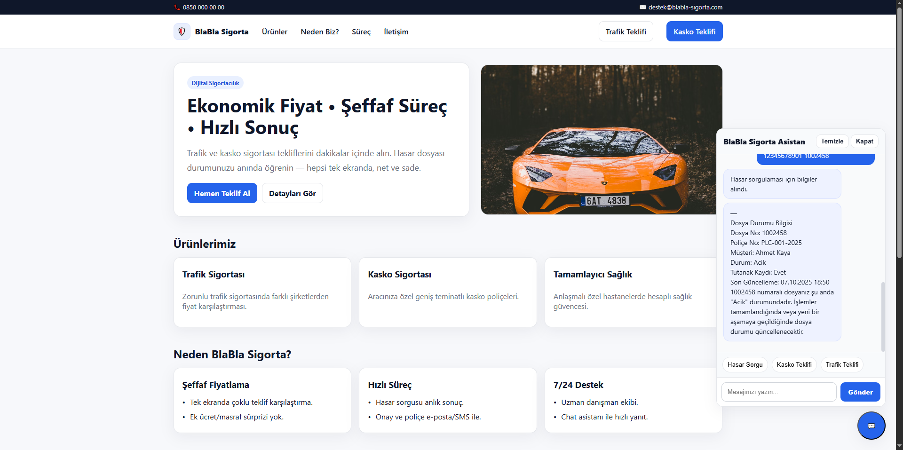

<div align="center">

# 🛡️ BlaBla Sigorta – Gemini Chatbot

**FastAPI + Google Gemini + PHP/MySQL**  
Hasar sorgu, kasko & trafik teklifi; müşteri tanıma ve canlı chat kutusu ile tam entegre demo.

[](https://www.python.org/)
[](https://fastapi.tiangolo.com/)
[](https://www.uvicorn.org/)
[](https://ai.google.dev/)
[](https://www.php.net/)
[](https://www.mysql.com/)
[](https://swagger.io/)
[](#-license)

</div>

---

## ✨ Önizleme

<p align="center">
  <!-- Kendi ekran görüntülerini /static altına koyup yolu güncelle -->
  
  <br />
  <sub>Minimal, açık temalı kurumsal demo site + sağ altta chat baloncuğu</sub>
</p>

---

## 🧭 İçindekiler
- [Özellikler](#-özellikler)
- [Mimari](#-mimari)
- [Kurulum (Hızlı Başlangıç)](#-kurulum-hızlı-başlangıç)

---

## 🚀 Özellikler
- **Niyet Algılama & Yönlendirme:** `general → hasar_sorgula / kasko_teklif / trafik_teklif / off_topic`
- **Müşteri Tanıma:** TCKN ile `hasar_detay` sorgusu (PHP API + MySQL JOIN)
- **Çift Baloncuk Yanıtı:** İlk baloncuk “bilgiler alındı”, ikinci baloncuk **API’den gelen detay** (`follow_up`)
- **Swagger Dokümantasyon:** FastAPI (`/swagger`) + PHP API (`swagger.html`)
- **Sade Modern UI:** `app/static/index.html` – açık tema, smooth chat, unread badge
- **Configurable:** `.env` ile `GEMINI_API_KEY`, `API_BASE`, CORS, model adı…

---

## 🏗 Mimari

FastAPI (Python)
├─ /chat ← Gemini yönlendirme + payload doğrulama
│ └─ PHP API'ye GET → hasar_detay (TCKN)
│ └─ MySQL (sigorta_chatbot)
└─ /swagger (OpenAPI UI)

PHP API (api.php)
├─ /api.php?table=musteri
├─ /api.php?table=hasar_dosya
└─ /api.php?table=hasar_detay&tckn=... ← JOIN + son kayıt

Static Frontend
└─ app/static/index.html ← Chat bubble, iki baloncuk desteği


---

## Kurulum (Hızlı Başlangıç)

### 1) Python (FastAPI)
```bash
# repo kökünde
pip install -r requirements.txt

# .env örneğini çoğalt, anahtarı gir
cp .env.example .env

# dev sunucu
python -m uvicorn app.main:app --host 0.0.0.0 --port 8000
# http://localhost:8000/swagger
```

<p> <a href="mailto:ucarkacar231415@gmail.com"></a> <a href="https://x.com/yefeblgn"></a> </p>


